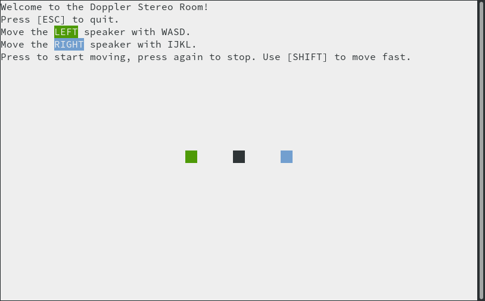

# Doppler Stereo Room

**Use headphones for this one!**

There are two speakers on the screen: green and blue. The green speaker plays the left stereo channel and the blue speaker plays the right.

The black square is your head.

You can move the speakers around as you like.

The 3D effect is achieved merely by [delaying the sound](https://en.wikipedia.org/wiki/Sound_localization) in one of the ears. Volume is always the same in both ears.

Things for you to try:

- Move both speakers to the same side of your head.
- Move one of the speakers past your head at a fast speed.

